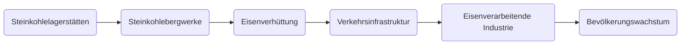

```mermaid
graph LR
A(Steinkohlelagerstätten) --> B(Steinkohlebergwerke) --> C(Eisenverhüttung)
C(Eisenverhüttung) --> D(Verkehrsinfrastruktur) --> E(Eisenverarbeitende Industrie)
E(Eisenverarbeitende Industrie) --> F(Bevölkerungswachstum)
```
