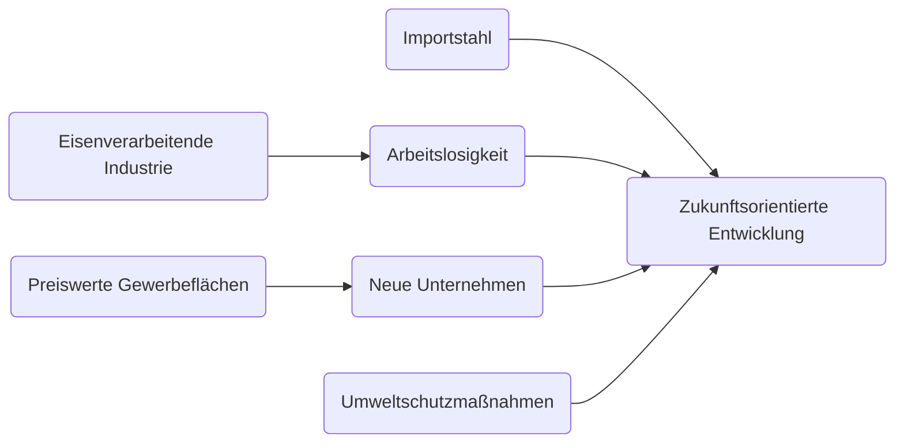

```mermaid
graph LR
G(Importstahl) --> H(Zukunftsorientierte Entwicklung)
E(Eisenverarbeitende Industrie) --> I(Arbeitslosigkeit)
I(Arbeitslosigkeit) --> H(Zukunftsorientierte Entwicklung)
J(Preiswerte Gewerbeflächen) --> K(Neue Unternehmen) --> H(Zukunftsorientierte Entwicklung)
L(Umweltschutzmaßnahmen) --> H(Zukunftsorientierte Entwicklung)
```
